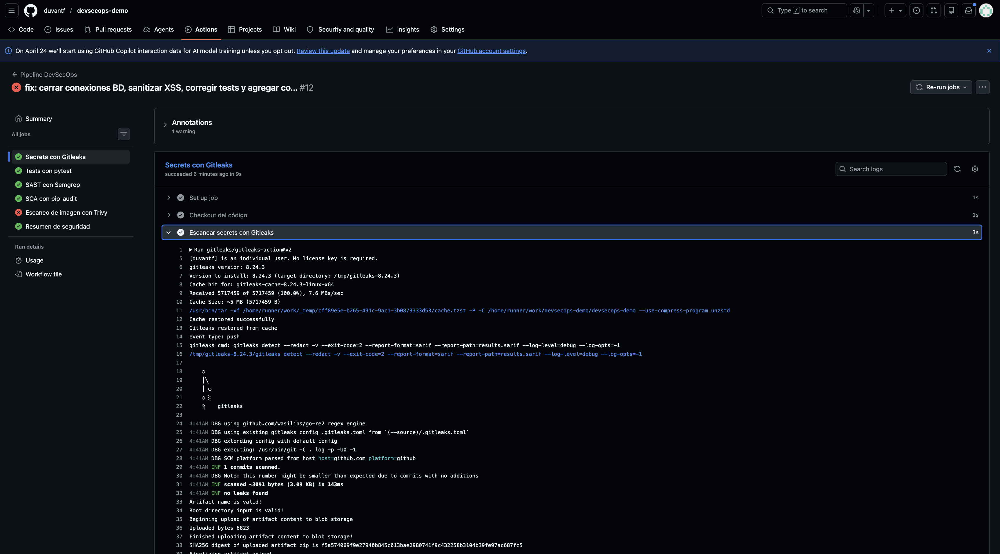
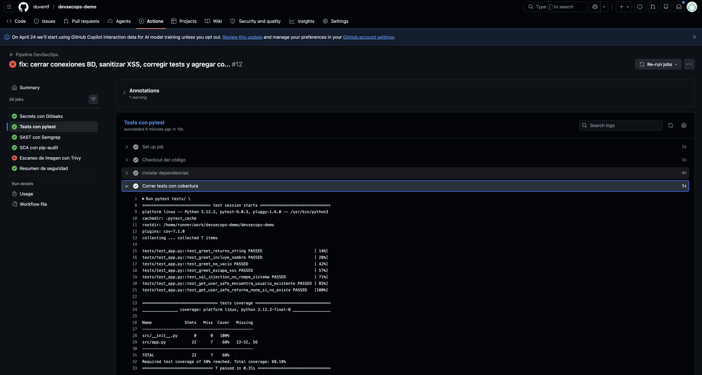
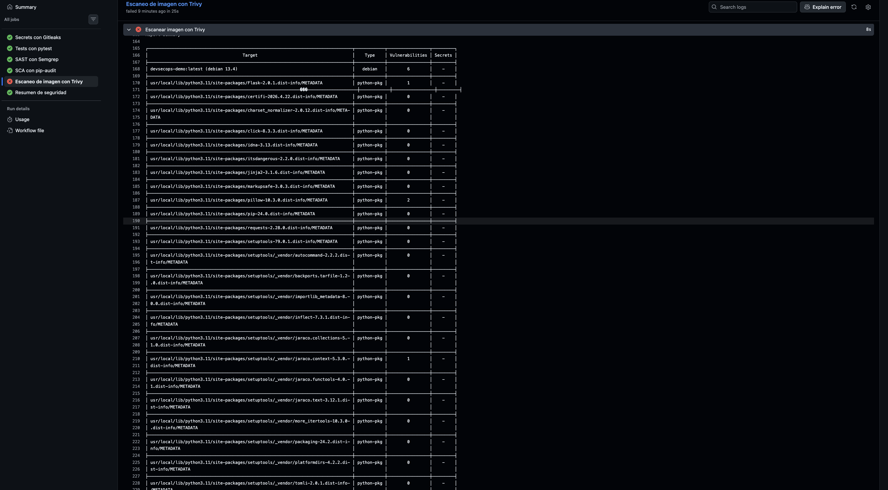
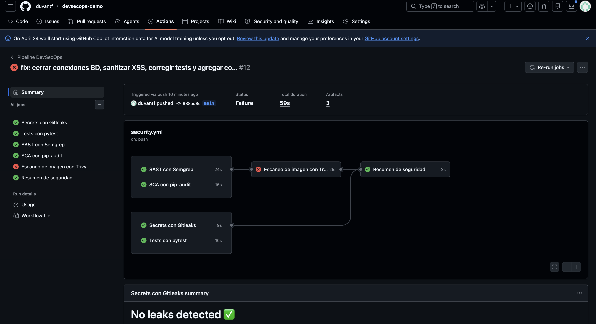

# DevSecOps Demo — Python


Proyecto práctico de aprendizaje DevSecOps construido desde cero.
Cada `git push` dispara un pipeline de seguridad automatizado en GitHub Actions.

---

## Evidencias del pipeline funcionando

### 1. Historial completo de runs
Cada commit disparó el pipeline automáticamente. Se ve la evolución del proyecto:
desde el primer intento fallido hasta todos los pasos en verde.


### 2. Gitleaks — Secrets scanning
Gitleaks escaneó el código buscando contraseñas, tokens y API keys hardcodeadas.
No encontró ningún secreto expuesto.



### 3. pytest — Tests de seguridad
Los tests de funcionalidad y SQL injection corrieron exitosamente.



### 4. Semgrep — detectando SQL Injection
El análisis SAST encontró la vulnerabilidad en `src/app.py` línea 18.
Regla activada: `python.lang.security.audit.formatted-sql-query`


### 5. Trivy — Vulnerabilidades en la imagen Docker
Trivy escaneó la imagen `devsecops-demo:latest` y encontró vulnerabilidades reales.
El pipeline se bloqueó automáticamente al detectarlas.





### 6. Resumen final del pipeline
Los pasos de seguridad completados exitosamente tras aplicar las correcciones.


---

## Qué aprendimos construyendo este proyecto

### DevSecOps en una frase
> "Seguridad automatizada en cada paso del ciclo de desarrollo,
> sin frenar al equipo."

### El ciclo que vivimos

```
git push
   ↓
Pipeline se dispara automáticamente
   ↓
Secrets → Tests → SAST → SCA → Docker → Resumen
   ↓
Reporte: qué está mal, en qué archivo, en qué línea
   ↓
Desarrollador corrige
   ↓
git push → pipeline corre de nuevo → pasa limpio
```

---

## Las vulnerabilidades que pusimos a propósito

### Vulnerabilidad 1 — SQL Injection en `src/app.py`

```python
# MAL: concatenar input del usuario en una query SQL
query = f"SELECT * FROM users WHERE username = '{username}'"
cursor.execute(query)
```

Semgrep lo detectó en la línea 18 con la regla
`python.lang.security.audit.formatted-sql-query`.

```python
# BIEN: parámetros preparados
cursor.execute("SELECT * FROM users WHERE username = ?", (username,))
```

### Vulnerabilidad 2 — Dependencia vulnerable en `requirements.txt`

```
Pillow==9.3.0  ← tiene CVEs conocidos
```

pip-audit la detecta comparando contra bases de datos de CVEs públicos.

---

## Hallazgos reales del pipeline — Trivy

Esta sección documenta vulnerabilidades **reales** encontradas por Trivy al escanear
la imagen Docker. No las pusimos a propósito — aparecieron solas. Eso es exactamente
lo que hace DevSecOps: encontrar lo que no sabías que tenías.

### ¿Qué escanea Trivy?
A diferencia de pip-audit (que solo revisa paquetes Python), Trivy escanea la imagen
completa: el sistema operativo base, las librerías del sistema y todos los paquetes
instalados.

### Vulnerabilidades del sistema operativo (Debian 13.4) — 6 HIGH

| Librería | CVE | Descripción | Fix disponible |
|---|---|---|---|
| `libncursesw6`, `libtinfo6`, `ncurses-base`, `ncurses-bin` | CVE-2025-69720 | Buffer overflow → ejecución de código arbitrario | ❌ Sin parche aún |
| `libsystemd0`, `libudev1` | CVE-2026-29111 | Ejecución de código o DoS vía IPC malicioso | ❌ Sin parche aún |

Estas vienen del sistema operativo base. La corrección es cambiar a una imagen más liviana:

```dockerfile
# ❌ Imagen completa — más superficie de ataque
FROM python:3.11

# ✅ Imagen mínima — menos paquetes expuestos
FROM python:3.11-slim
```

### Vulnerabilidades de paquetes Python — 9 HIGH

| Paquete | Versión instalada | CVE | Descripción | Versión corregida |
|---|---|---|---|---|
| `Flask` | 2.0.1 | CVE-2023-30861 | Exposición de cookies de sesión | 2.3.2 |
| `Pillow` | 10.3.0 | CVE-2026-25990 | Out-of-bounds write vía imagen PSD | 12.1.1 |
| `Pillow` | 10.3.0 | CVE-2026-40192 | DoS vía decompression bomb | 12.2.0 |
| `urllib3` | 1.26.20 | CVE-2025-66418 | Descompresión sin límite → agotamiento de recursos | 2.6.0 |
| `urllib3` | 1.26.20 | CVE-2025-66471 | Manejo incorrecto de datos comprimidos | 2.6.0 |
| `urllib3` | 1.26.20 | CVE-2026-21441 | Bypass de protección anti-decompression bomb | 2.6.3 |
| `wheel` | 0.45.1 | CVE-2026-24049 | Escalación de privilegios vía wheel malicioso | 0.46.2 |
| `jaraco.context` | 5.3.0 | CVE-2026-23949 | Path traversal vía archivos tar maliciosos | 6.1.0 |

Corrección en `requirements.txt`:

```txt
Flask>=2.3.2
Pillow>=12.2.0
urllib3>=2.6.3
wheel>=0.46.2
```

### Por qué el pipeline bloqueó en este paso

El workflow está configurado para detener el pipeline cuando Trivy encuentra
vulnerabilidades HIGH o CRITICAL. El pipeline cumplió su función: detectó
problemas reales antes de que la imagen llegara a producción.

```yaml
- name: Run Trivy
  uses: aquasecurity/trivy-action@master
  with:
    exit-code: '1'          # ← bloquea el pipeline si hay hallazgos
    severity: 'HIGH,CRITICAL'
```

---

## Lección importante que descubrimos

La primera versión del pipeline con Semgrep **no detectó** el SQL injection.
Tuvimos que agregar la regla `p/bandit` (específica para Python) para que lo encontrara.

Lo mismo aplica con Trivy: detectó vulnerabilidades del sistema operativo que
pip-audit nunca hubiera encontrado porque solo revisa paquetes Python.

> Ninguna herramienta detecta el 100% de las vulnerabilidades.
> Por eso se usan múltiples capas de análisis.

---

## El pipeline — qué hace cada paso

| Paso | Herramienta | Qué detecta | Bloquea |
|---|---|---|---|
| Secrets | Gitleaks | Contraseñas y API keys en el código | Sí |
| Tests | pytest | Funcionalidad rota y cobertura < 50% | Sí |
| SAST | Semgrep | Vulnerabilidades en el código fuente | No |
| SCA | pip-audit | Dependencias Python con CVEs conocidos | No |
| Docker | Trivy | Vulnerabilidades HIGH/CRITICAL en la imagen | Sí |

---

## Estructura del proyecto

```
devsecops-demo/
├── .github/
│   └── workflows/
│       └── security.yml   ← pipeline principal
├── docs/
│   ├── 01-historial-pipeline.png
│   ├── 02-semgrep-sql-injection.png
│   ├── 03-resumen-pipeline.png
│   ├── 04-trivy-hallazgos.png
│   ├── 05-trivy-pipeline-fail.png
│   ├── 06-pytest-resultados.png
│   └── 07-gitleaks-ok.png
├── src/
│   └── app.py             ← app con vulnerabilidad intencional
├── tests/
│   └── test_app.py        ← tests de seguridad con pytest
├── .gitleaks.toml         ← configuración de secrets scanning
├── Dockerfile
├── requirements.txt
└── README.md
```

---

## Ejercicio propuesto

1. Corrige el SQL injection en `src/app.py`
2. Actualiza `Pillow==9.3.0` a `Pillow>=12.2.0`
3. Actualiza `Flask`, `urllib3` y `wheel` a las versiones corregidas
4. Cambia la imagen base en el `Dockerfile` a `python:3.11-slim`
5. Haz push y verifica que el pipeline pase completamente limpio

Ese es el ciclo DevSecOps: **detectar → corregir → validar → repetir.**
