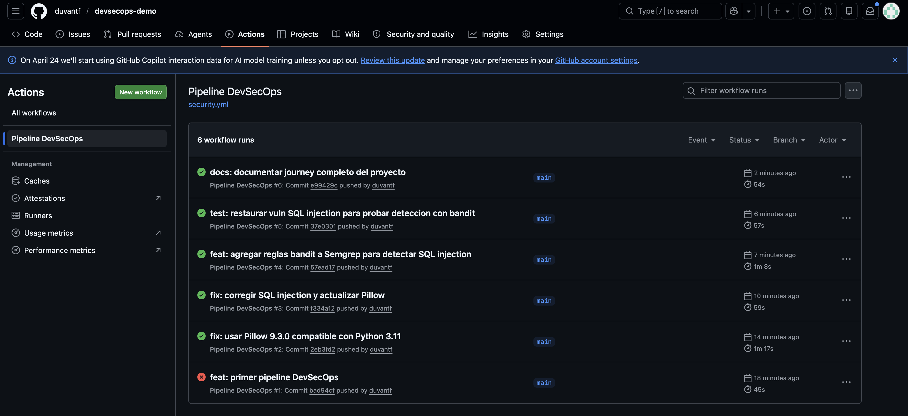
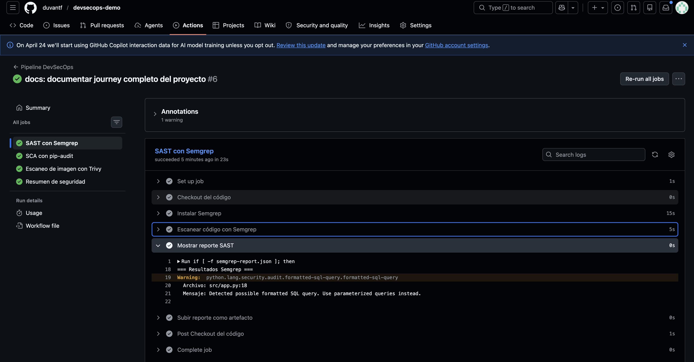
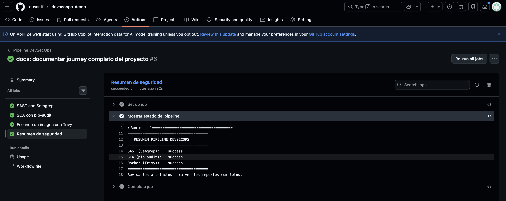

# DevSecOps Demo — Python

Proyecto práctico de aprendizaje DevSecOps construido desde cero.
Cada `git push` dispara un pipeline de seguridad automatizado en GitHub Actions.

---

## Evidencias del pipeline funcionando

### 1. Historial completo de runs
Cada commit disparó el pipeline automáticamente. Se ve la evolución del proyecto:
desde el primer intento fallido hasta todos los pasos en verde.



### 2. Semgrep detectando SQL Injection
El análisis SAST encontró la vulnerabilidad en `src/app.py` línea 18.
Regla activada: `python.lang.security.audit.formatted-sql-query`



### 3. Resumen final del pipeline
Los tres pasos de seguridad completados exitosamente.



---

## Qué aprendimos construyendo este proyecto

### DevSecOps en una frase
> "Seguridad automatizada en cada paso del ciclo de desarrollo,
> sin frenar al equipo."

En vez de revisar seguridad al final (o nunca), el pipeline la integra
desde el primer commit. El desarrollador recibe el reporte en minutos,
no semanas después.

### El ciclo que vivimos
```
git push
   ↓
Pipeline se dispara automáticamente
   ↓
SAST  →  SCA  →  Docker  →  Resumen
   ↓
Reporte: qué está mal, en qué archivo, en qué línea
   ↓
Desarrollador corrige
   ↓
git push → pipeline corre de nuevo → pasa limpio
```

### Las vulnerabilidades que pusimos a propósito

**Vulnerabilidad 1 — SQL Injection en `src/app.py`**

```python
# MAL: concatenar input del usuario en una query SQL
query = f"SELECT * FROM users WHERE username = '{username}'"
cursor.execute(query)
```

Un atacante puede escribir `' OR '1'='1` como username y obtener
todos los registros de la base de datos. Semgrep lo detectó en la
línea 18 con la regla `python.lang.security.audit.formatted-sql-query`.

```python
# BIEN: parametros preparados
cursor.execute("SELECT * FROM users WHERE username = ?", (username,))
```

**Vulnerabilidad 2 — Dependencia vulnerable en `requirements.txt`**

```
Pillow==9.3.0  ← tiene CVEs conocidos
```

pip-audit la detecta comparando contra bases de datos de CVEs públicos.
La corrección es actualizar a una versión sin vulnerabilidades conocidas.

### Lección importante que descubrimos
La primera versión del pipeline con Semgrep **no detectó** el SQL injection.
Tuvimos que agregar la regla `p/bandit` (específica para Python) para que
lo encontrara. Esto refleja la realidad de DevSecOps:

> Ninguna herramienta detecta el 100% de las vulnerabilidades.
> Por eso se usan múltiples capas de análisis.

---

## El pipeline — qué hace cada paso

| Paso | Herramienta | Qué detecta | Tiempo |
|------|-------------|-------------|--------|
| SAST | Semgrep | Vulnerabilidades en el código fuente | ~23s |
| SCA  | pip-audit | Dependencias con CVEs conocidos | ~23s |
| Docker | Trivy | Vulnerabilidades en la imagen del contenedor | ~2min |
| Resumen | GitHub Actions | Estado global del pipeline | ~2s |

---

## Estructura del proyecto
```
devsecops-demo/
├── .github/
│   └── workflows/
│       └── security.yml   ← pipeline principal
├── docs/                  ← evidencias del pipeline
├── src/
│   └── app.py             ← app con vulnerabilidad intencional
├── Dockerfile
├── requirements.txt       ← dependencia vulnerable intencional
└── README.md
```

---

## Ejercicio propuesto

1. Corrige el SQL injection en `src/app.py` — usa solo `get_user_safe`
2. Actualiza `Pillow==9.3.0` a `Pillow>=10.3.0` en `requirements.txt`
3. Haz push y verifica que el pipeline pase completamente limpio

Ese es el ciclo DevSecOps: **detectar → corregir → validar → repetir.**